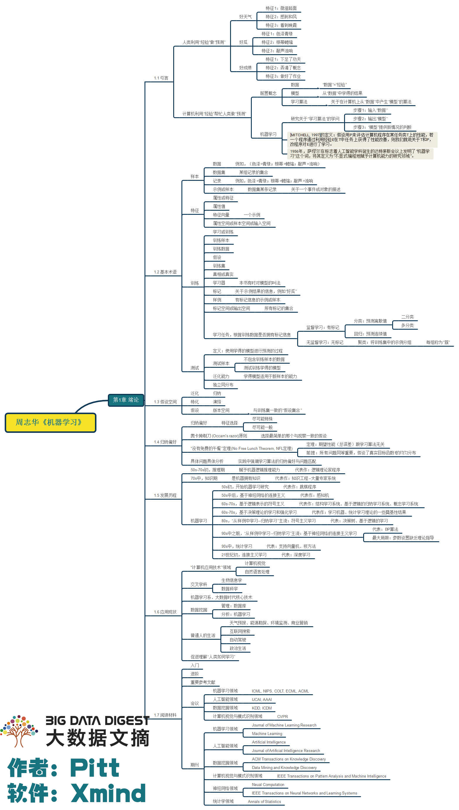
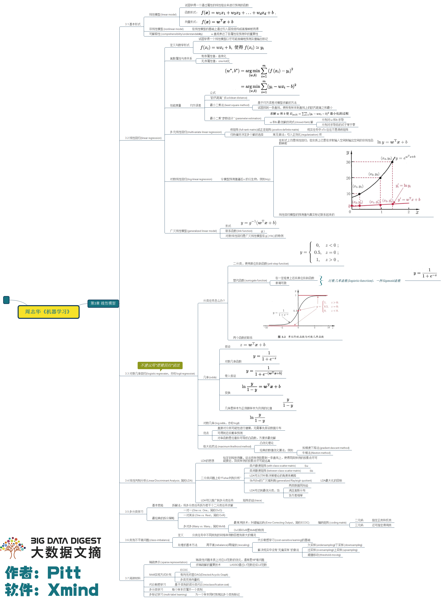

### 第1章 绪论

- 对于一个学习算法a,若它在某问题上比学习算法b好,则必然存在另一些问题,在那里b比a好.即**"没有免费的午餐"定理**(No Free Lunch Theorem,NFL).因此要谈论算法的相对优劣,必须要针对具体的学习问题

### 第2章 模型评估与选择

- m次n折交叉验证实际上进行了m*n次训练和测试
- 可以用**F1度量的一般形式Fβ**来表达对查准率/查全率的偏好:
- **偏差**度量了学习算法的期望预测与真实结果的偏离程度,即学习算法本身的拟合能力,**方差**度量了同样大小的训练集的变动所导致的学习性能的变化,即数据扰动造成的影响.**噪声**表达了当前任务上任何学习算法所能达到的期望泛化误差的下界,即学习问题本身的难度.

### 第3章 线性模型

- **线性判别分析(LDA)**是一种经典的**监督线性降维方法**:设法将训练样例投影到一条直线上,使同类样例的投影点尽可能接近,异类样例的投影点尽可能远离.对新样本分类时根据投影点的位置来确定类别.
- **多分类学习的分类器**一般有以下三种策略:

1. 一对一(OvO),N个类别产生N * (N - 1) / 2种分类器
2. 一对多(OvR或称OvA),N个类别产生N - 1种分类器
3. 多对多(MvM),如纠错输出码技术

- 解决**类别不平衡问题**的三种方法:

1. **过采样法**,增加正例使正负例数目接近,如**SMOTE**:思想是合成新的少数类样本,合成的策略是对每个少数类样本a,从它的最近邻中随机选一个样本b,然后在a、b之间的连线上随机选一点作为新合成的少数类样本.
2. **欠采样法**,减少负例使正负例数目接近,如**EasyEnsemble**:每次从大多数类中抽取和少数类数目差不多的重新组合,总共构成n个新的训练集,基于每个训练集训练出一个AdaBoost分类器（带阈值）,最后结合之前训练分类器结果加权求和减去阈值确定最终分类类别.
3. 再缩放法